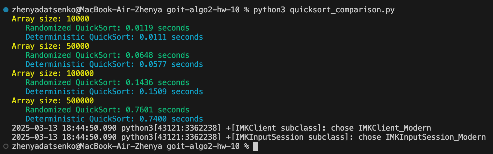
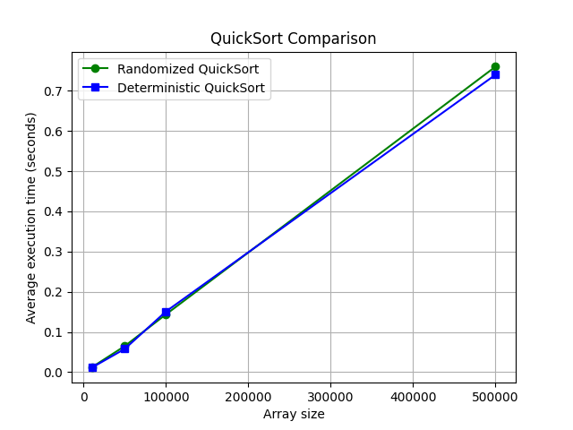
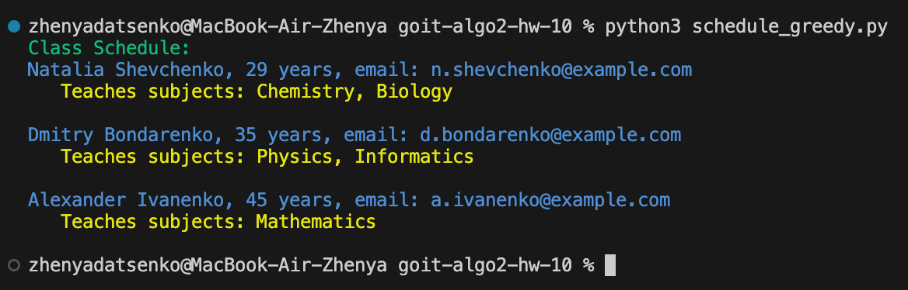

# Homework Module: Algorithmic Complexity, Approximate and Randomized Algorithms

## Overview

This homework model focuses on implementing and comparing algorithms related to algorithmic complexity and greedy algorithms. It consists of two main tasks:

1. **QuickSort Comparison**: Implementing and comparing the performance of randomized and deterministic QuickSort algorithms.
2. **Class Schedule Creation**: Using a greedy algorithm to create a class schedule that minimizes the number of teachers required to cover all subjects.

## Tasks Description

### Task 1: QuickSort Comparison

- **Objective**: Implement randomized and deterministic QuickSort algorithms and compare their performance on arrays of different sizes.
- **Requirements**:
  - Implement both algorithms.
  - Measure and compare their execution times on arrays of varying sizes.
  - Visualize the results using a graph.

### Task 2: Class Schedule Creation

- **Objective**: Create a class schedule using a greedy algorithm to minimize the number of teachers needed to cover all subjects.
- **Requirements**:
  - Implement a greedy algorithm to assign teachers to subjects.
  - Ensure all subjects are covered if possible.
  - Display the schedule and indicate if any subjects cannot be covered.

## Results

### Task 1: QuickSort Comparison

- **Execution Times**: The execution times for both algorithms were measured and compared across different array sizes.
- **Visualization**: A graph was created to visualize the performance comparison.
- **Conclusion**: The randomized QuickSort generally performed better than the deterministic version, especially on larger datasets.

### Task 2: Class Schedule Creation

- **Schedule**: A class schedule was successfully created using the greedy algorithm.
- **Coverage**: All subjects were covered by the assigned teachers.
- **Efficiency**: The algorithm minimized the number of teachers required to cover all subjects.

